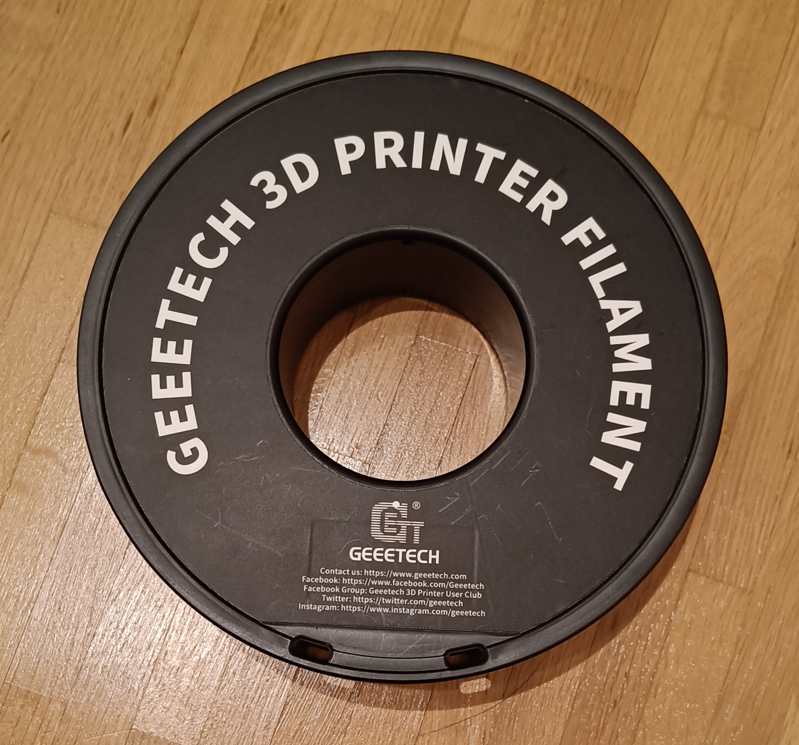
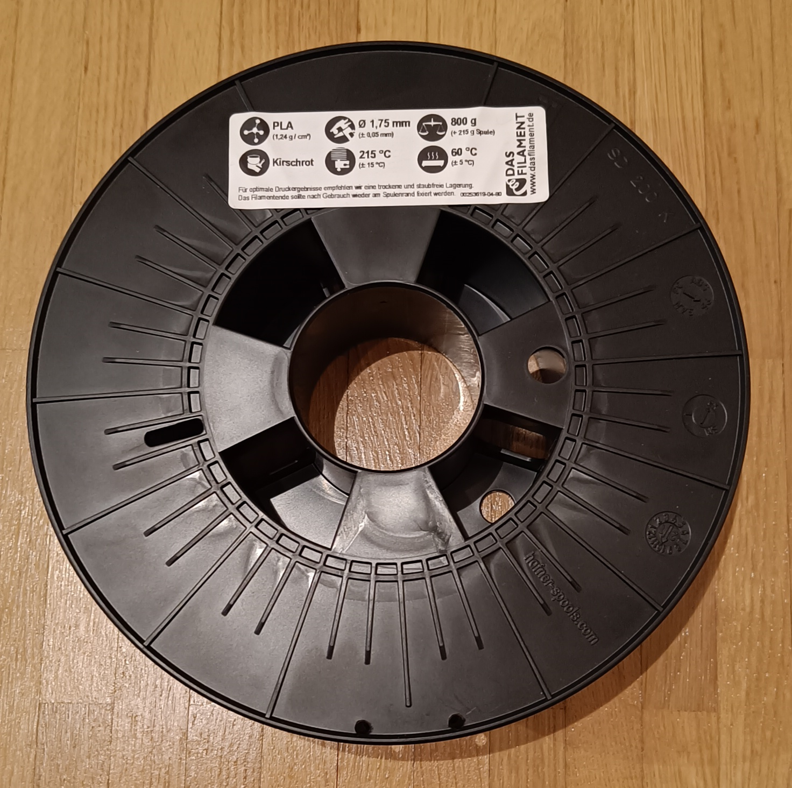

|Type|Brand|Spool Weight|Print Temperature|Retraction|Flow|Buyed|Picture|
|---|---|---|---|---|---|---|---|
|PLA|Geeetech|182g - 188g|210 °C|0.6mm|97% - 99%|2022||
|PLA|Das Filament|214g - 215g|210 °C|0.8mm|95% - 97%|2022||
|PLA+ Silk|Sunlu|126g - 129g|210°C|0.8mm|100% - 102%|2022||
|ABS|Sunlu||250 °C|0.5mm|95%|2022||

To provide more filaments, please leave comments with information about them.

If you like, buy me a coffee 

freakyDude
