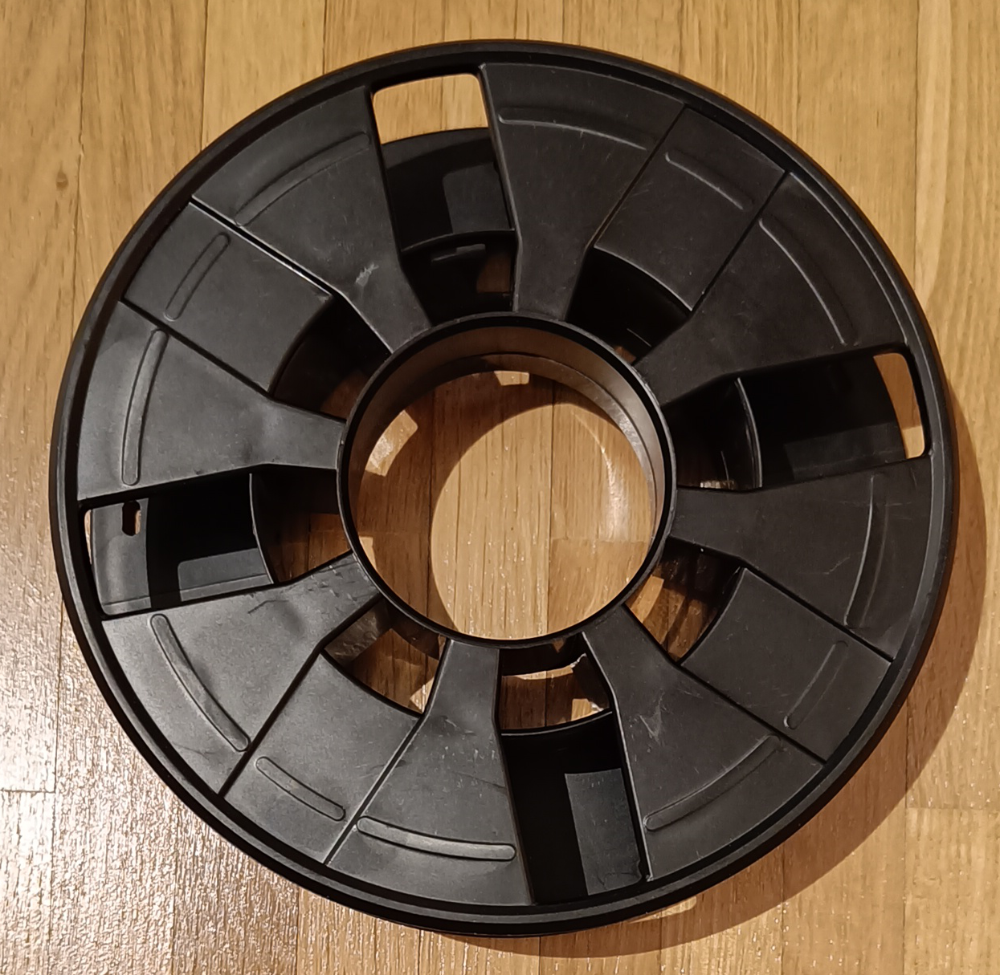

| Type      | Brand        | Filament Weight | Spool Weight | Print Temperature | Retraction | Flow | Buyed | Picture                                                                           |
| --------- | ------------ | --------------- | ------------ | ----------------- | ---------- | ---- | ----- | --------------------------------------------------------------------------------- |
| PLA       | Geeetech     | 1000g           | 182g - 188g  | 210°C             | 0.8mm      | 98%  | 2022  |       |
| PLA       | Das Filament | 1000g           | 214g - 215g  | 210°C             | 0.8mm      | 96%  | 2022  |  |
| PLA+      | iMetrx       | 250g            | 111g - 114g  | 210°C             | 0.8mm      | 96%  | 2022  |             |
| PLA+      | Sunlu        | 1000g           | 126g - 129g  | 210°C             | 0.8mm      | 100% | 2022  |                                                                                   |
| PLA+ Silk | Sunlu        | 1000g           | 126g - 129g  | 210°C             | 0.8mm      | 100% | 2022  |     |
| ABS       | Sunlu        | 1000g           | 1000g        | 250°C             | 0.5mm      | 98%  | 2022  |                                                                                   |

Please leave a comment if there is something wrong or missing. Or if you have any questions.
Have fun!

If you enjoyed this article and would like to support my work, feel free to buy me a coffee! Your support helps me continue creating content. Thank you! 
