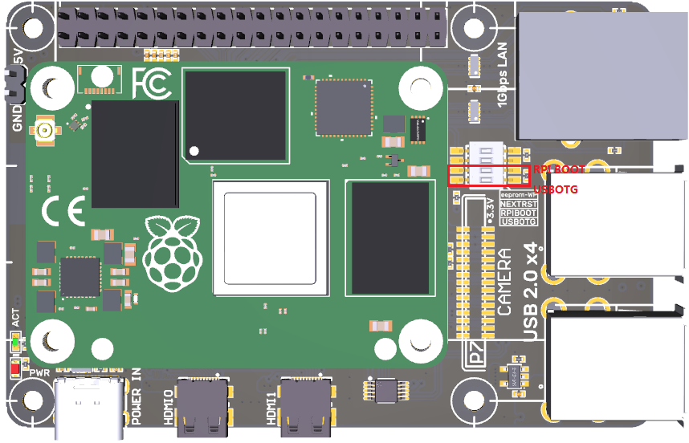
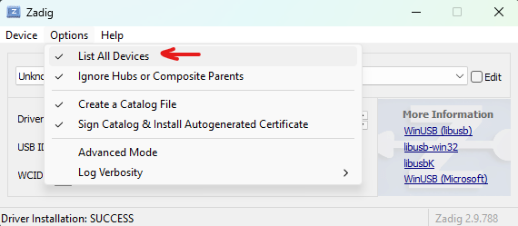
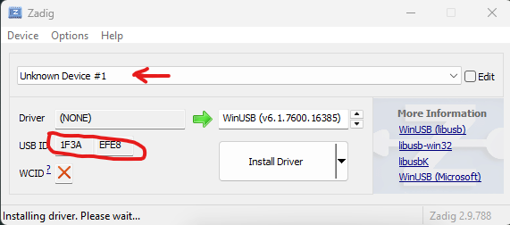

This step-by-step guide explains how to flash Armbian Linux onto the Bigtreetech CB1 eMMC compute module. While I describe the process for a Windows machine, the steps are very similar for Linux users.

The eMMC version of the CB1 has built-in storage, which makes the process slightly more complicated than flashing an SD card for non-eMMC versions.

## Requirements

You will need the following items to complete the process.

### Hardware

- A Bigtreetech RPI adapter or a Bigtreetech Manta board to provide the necessary USB and LAN connectors.
- A USB-C cable to connect and power the CB1 from your Windows machine. For added reliability, I recommend using a USB hub with a dedicated power adapter in between.

### Software

- A universal USB driver. See [Zadig](https://zadig.akeo.ie/)
- AllWinner tools to switch the CB1 into USB device mode. See [sunxi-tools](https://github.com/bigtreetech/sunxi-tools) or [Here](http://linux-sunxi.org/FEL/USBBoot#Using_sunxi-fel_on_Windows)
- An Armbian Linux image of your choice. See [Armbian for CB1](https://www.armbian.com/bigtreetech-cb1/)
- An image flashing tool. I used [Balena Etcher](https://etcher.balena.io/)

## Flash the Image to eMMC

- Switch to EMMC USB Storage Mode. Set the DIP switches (USB OTG) and (RPI BOOT) to ON to enter BOOT mode
  

### Install the Universal USB Storage Driver

- Connect your CB1 to your windows machine
- Install and Start Zadig
  - Download and run [Zadig](https://zadig.akeo.ie/)
- List All USB Devices
  - In Zadig, list all USB devices on your machine.
    
- Identify Your CB1
  - Look for your device, which will likely appear as an unknown device. Try each device until you find the one with the correct USB ID
    
    - If you cannot find it, ensure that the DIP switches are set correctly and that your USB connection is functioning properly.
- Install Driver

### Enable CB1 eMMC Storage as an USB Storage Device

- Download Required Files

  - Obtain `sunxi-fel.exe` and `u-boot-sunxi-cb1-emmc.bin` from [sunxi-tools](https://github.com/bigtreetech/sunxi-tools)

- Open a Windows Command Prompt:

  - Press `<WIN>+<R>`, type `cmd` and press `<ENTER>`

- Run the sunxi-fel Command

  - Navigate to the folder containing the downloaded sunxi-tools and run the following command

  ```bat
  sunxi-fel.exe uboot u-boot-sunxi-cb1-emmc.bin
  ```

  - This will switch the CB1 into USB storage mode.

- Flash the Armbian Image
  - Start [Balena Etcher](https://etcher.balena.io/)
  - Select the downloaded Armbian image and flash your CB1 (it should appear as a storage device).
  - No need to change the default settings. Begin the flashing process.

### Mandatory Armbian Configuration

- Modify the `armbianEnv.txt` file
- Replace the line

  ```ini
  fdtfile=allwinner/sun50i-h616-bigtreetech-cb1-sd.dtb
  ```

  with

  ```ini
  fdtfile=allwinner/sun50i-h616-bigtreetech-cb1-emmc.dtb
  ```

  This change activates the eMMC storage as the boot device. You can revert to the previous setting to boot from an SD card if needed.

### CleanUp

- Unmount the eMMC
  - Safely eject the EMMC storage from your system.
- Disconnect Power
  - Remove the USB cable or power source.
- Reset the DIP Switches
  - Set the DIP switches (USB OTG) and (RPI BOOT) back to OFF to exit BOOT mode.

## Final Steps

Congratulations! You should now have successfully flashed Armbian onto your Bigtreetech CB1. You can connect the CB1 to a display and keyboard or to your network and follow the official Armbian documentation for further setup.

## Further Links

- [Armbian BIGTREETECH CB1](https://www.armbian.com/bigtreetech-cb1/)
- [BIGTREETECH sunxi-tools](https://github.com/bigtreetech/sunxi-tools)
- [BIGTREETECH CB1 Repositry](https://github.com/bigtreetech/CB1)
- [BIGTREETECH CB1 Wiki](https://bttwiki.com/CB1.html)
- [SUNXI Wiki](https://linux-sunxi.org/)

## Support me

Please leave a comment if there is something wrong or missing. Or if you have any questions.
Have fun!

If you enjoyed this article and would like to support my work, feel free to buy me a coffee! Your support helps me continue creating content. Thank you! [](https://ko-fi.com/F2F7GC8PC)
