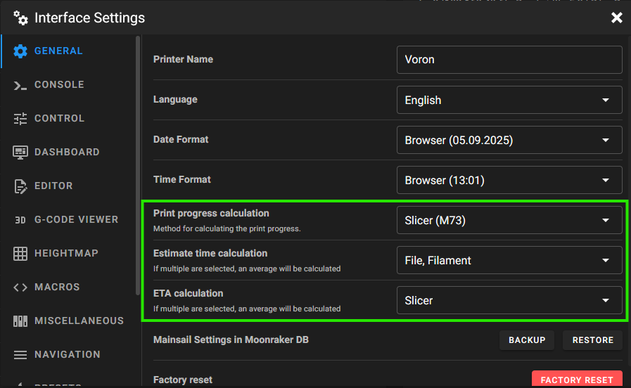

## Intro

One of the common frustrations among 3D printing enthusiasts is the inaccuracy of print time estimations provided by slicing software and firmware. This can lead to unexpected delays and scheduling issues. Fortunately, with Klipper firmware, you can significantly improve the accuracy of print time estimations by using the Klipper Estimator plugin along with proper configuration in Moonraker, Mainsail, and KlipperScreen.

## Configure Klipper Estimator in Moonraker

1. First, enable the Klipper Estimator plugin in Moonraker. This plugin analyzes your G-code files and provides more accurate print time estimations based on factors such as print speed and acceleration.

   To enable the plugin, add the following section to your `moonraker.conf` file:

   ```ini
   [analysis]
   auto_dump_default_config: true
   enable_auto_analysis: true
   enable_estimator_updates: true
   ```

2. Next, configure Mainsail to use slicer estimations where possible.
   Go to Mainsail > Settings:

   - Print progress calculation → "Slicer (M73)"
   - ETA calculation method → "Slicer"
   - Estimate time calculation → "File, Filament"

   

3. Set up KlipperScreen to show the estimated time.
   Go to `KlipperScreen.conf` and add to the main section:

   ```ini
   [main]
   print_estimate_method = slicer
   ```

   Or use the UI to set it.

4. Restart Moonraker and KlipperScreen to apply the changes.

## What Does Klipper Estimator Take Into Account?

The Klipper Estimator plugin provides more accurate print time predictions by analyzing your G-code and considering several important factors, including:

- **Configured maximum speeds and accelerations:** It uses your printer's actual speed and acceleration limits set in `printer.cfg`, rather than generic slicer assumptions.
- **Movement planning:** It simulates how Klipper will execute each move, including acceleration and deceleration phases, to estimate realistic timings.
- **Extruder and toolhead changes:** The estimator accounts for tool changes, retractions, and priming moves, which can add up over long prints.
- **Layer changes and Z-moves:** Vertical movements and layer transitions are included in the calculation.
- **Pauses and delays:** Any G-code commands that introduce pauses or dwell times are factored into the estimate.
- **Firmware retraction and pressure advance:** If you use features like pressure advance or firmware retraction, the estimator includes their impact on print timing.

By considering these real-world printer behaviors, Klipper Estimator can provide a much more reliable print time estimate than slicers alone.

## Conclusion

With these simple steps, you can significantly improve the print time estimation in Klipper. The Klipper Estimator plugin takes into account your printer's speed and acceleration settings to provide a more accurate estimate. This will help you better plan your printing schedule and reduce frustration caused by inaccurate estimates.

Happy printing!

## Further Links

- [Moonraker Documentation](https://moonraker.readthedocs.io/en/latest/configuration/#analysis)
- [Klipper Estimator GitHub](https://github.com/Annex-Engineering/klipper_estimator)

## Support me

Please leave a comment if there is something wrong or missing, or if you have any questions.
Have fun!

If you enjoyed this article and would like to support my work, feel free to buy me a coffee! Your support helps me continue creating content. Thank you! [](https://ko-fi.com/F2F7GC8PC)
