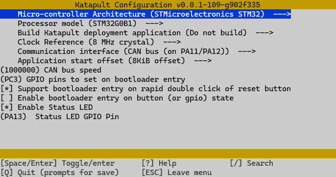

## About

For my own purposes, this is a quick and dirty guide on how to flash the BTT Manta M8P CAN and the EBB42 board with Klipper firmware using Katapult. This process should work for other BTT Manta M8P and EBB versions too, but you have to adjust the configuration accordingly.

## USB or CAN Bus

The BTT Manta M8P CAN board can be flashed and used with Klipper firmware via two different methods: USB connection or CAN Bus. If you are using toolhead boards like the EBB36 or EBB42 that support CAN Bus, it is mandatory to use the CAN Bus method for communication between the mainboard and toolhead boards. If you are using toolhead boards that support USB connection (like the BTT SB2209 USB or the EBB36/42 v2.0), use USB connection instead.

In general, CAN Bus is the preferred method for communication between multiple boards in a 3D printer setup, as it provides better reliability and performance compared to USB connections.

## My Artillery Sidewinder X2 Setup

- I replaced the original Artillery Mainboard with a BTT Manta M8P v1.1 board running in CAN Mode.
- I replaced the original Artillery Toolhead board with a BTT EBB42 v1.2 board running in CAN Mode.

### Flashing the BTT Manta M8P v1.1 in CAN Mode with Katapult

#### Flash katapult to the BTT Manta M8P v1.1

This step is only necessary if you have a brand new BTT Manta M8P board without Katapult installed. If you already have Katapult installed, you can skip this step.

1. Download [Katapult](https://github.com/Arksine/katapult).

   ```sh
   cd ~
   git clone https://github.com/Arksine/katapult
   cd katapult   
   ```

2. Configure Katapult for the BTT Manta M8P v1.1 CAN:

   ```sh
   make menuconfig
   ```

   

   Be aware that I have also enabled the PC3 GPIO Pin. If you have connected a device like the BTT Relay V1.2 to the PS-ON GPIO Pin the power supply is switched via this pin.

   Save and exit with `Quit` and `Yes`.
3. Build the firmware-bootloader package:

   ```sh
   make -j
   ```

4. Flash Katapult

   ```sh
   dfu-util -R -a 0 -s 0x08000000:mass-erase:force -D ~/katapult/out/katapult.bin
   ```

5. Reset the board (or power off/on). Katapult should now be installed, the status LED will blink.

#### Flash Klipper to the BTT Manta M8P v1.1 in CAN Mode

1. Configure Klipper Firmware for the BTT Manta M8P v1.1 CAN:

   ```sh
   cd ~
   cd klipper
   make menuconfig
   ```

   

   Be aware that I have also enabled the PC3 GPIO Pin. If you have connected a device like the BTT Relay V1.2 to the PS-ON GPIO Pin the power supply is switched via this pin.

   Save and exit with `Quit` and `Yes`.
2. Build the Klipper firmware:

   ```sh
   make -j
   ```

3. Stop Klipper service first:

   ```sh
   sudo service klipper stop
   ```

4. Flash Klipper
   1. Depending if Klipper is already running (update workflow) on the board, you need to switch into bootloader mode first. Run the following command to do so:

      ```sh
      ~/klippy-env/bin/python ~/katapult/scripts/flashtool.py -i can0 -u <CANBUS-UUID> -r
      ```

      Replace `<CANBUS-UUID>` with the actual CANBUS-UUID of your board. (Configured in `printer.cfg` under `[mcu]` section as `canbus_uuid`)
   2. Now the should get something similar to this:

      ```sh
      Canbus Bridge detected at /sys/bus/usb/devices/1-1.4
      Connecting to CAN UUID 4a0cb5640a86 on interface can0
      Sending bootloader jump command...
      Waiting for USB Reconnect...done
      Detected new USB Device: 1d50:6177 katapult stm32g0b1xx
      Katapult detected at serial port /dev/ttyACM0
      Bootloader Request Complete
      ```

      Your board is now in bootloader mode. You can connect to it via the serial port `/dev/ttyACM0`.
   3. Finally, flash the Klipper firmware:

      ```sh
      cd ~/klipper
      make flash FLASH_DEVICE=/dev/ttyACM0
      ```

      This should quit with an `CAN Flash Success` message.
5. Restart Klipper to apply the changes.

   ```sh
   sudo service klipper restart
   ```

### Flashing the BTT EBB42 v1.2 in CAN Mode with Katapult

#### Flash katapult to the BTT EBB42 v1.2 CAN

This step is only necessary if you have a brand new BTT EBB42 board without Katapult installed. If you already have Katapult installed, you can skip this step.

1. Connect your EBB42 via USB and Flash Katapult.
   1. Power off your printer
   2. Unplug the CAN Bus cable from the EBB42 board to avoid any power issues.
   3. Temporarily bridge the 5V Jumper on the EBB42 board to power it via USB.
   4. Put the board into DFU mode by holding the BOOT button while plugging in the USB cable. Or as an alternative, press and hold the BOOT button, press reset, release reset, then release BOOT.
   5. The board should now be in DFU mode and ready to be flashed.

2. If needed, download [Katapult](https://github.com/Arksine/katapult).

   ```sh
   cd ~
   git clone https://github.com/Arksine/katapult
   cd katapult   
   ```

3. Configure Katapult for the BTT Manta M8P v1.1 CAN:

   ```sh
   cd ~/katapult
   make menuconfig
   ```

   

   Save and exit with `Quit` and `Yes`.
4. Build the firmware-bootloader package:

   ```sh
   make -j
   ```

5. Flash Katapult:

   ```sh
   sudo dfu-util -R -a 0 -s 0x08000000:mass-erase:force -D ~/katapult/out/katapult.bin
   ```

   This should finish with a `File downloaded successfully` message.

6. Remove 5V Power Jumper, remove your usb cable and power off your printer.
   Add your CAN Bus cable to the EBB42 board, then power on. Katapult should now be installed.

#### Flash Klipper to the BTT EBB42 v1.2 CAN

1. Configure Klipper Firmware for the BTT EBB42 v1.2 CAN CAN:

   ```sh
   cd ~
   cd klipper
   make menuconfig
   ```

   

   Save and exit with `Quit` and `Yes`.
2. Build the Klipper firmware:

   ```sh
   make -j
   ```

3. Stop Klipper service first:

   ```sh
   sudo service klipper stop
   ```

4. Query the CAN Bus UUID of the EBB42 board:

   ```sh
   ~/klippy-env/bin/python ~/klipper/scripts/canbus_query.py can0
   ```

   You should get something like this: `Found canbus_uuid=c239709a91c7, Application: CanBoot`

   Make a note of the `CAN UUID`, it should be the uuid of the your EBB42 board. Note it for the next step.

5. Flash Klipper to EBB42

   ```sh
   ~/klippy-env/bin/python3 ~/katapult/scripts/flash_can.py -i can0 <CANBUS_UUID> -f ~/klipper/out/klipper.bin -u
   ```

   Replace `<CANBUS-UUID>` with the actual CANBUS-UUID of your board. (Noted from the last step or configured in `printer.cfg` under `[mcu ebb42]` section as `canbus_uuid`)

   This should result in something like this:

   ```sh
   Verifying canbus connection
   Flashing '/home/freaky/klipper/out/klipper.bin'...

   [##################################################]

   Write complete: 21 pages
   Verifying (block count = 649)...

   [##################################################]

   Verification Complete: SHA = 0CD35886C377A91B5AB0E0AD44684CB24DEBE05E
   Programming Complete
   ```

   If you get any errors, and you double checked your CANBUS UUID, try to reset the EBB42 board by power cycling your printer and try again. If this not work, begin again from flashing Katapult to the EBB42 board.

6. Restart Klipper to apply the changes.

   ```sh
   sudo service klipper restart
   ```

## My Voron 2.4 Setup

- Mainboard: BTT Manta M8P v2.0 (USB Mode)
- Toolhead board: BTT EBB SB2209 v1.10 USB

*incomplete - coming soon

## Further Links

- [Klipper Documentation](https://www.klipper3d.org/)
- [Klipper Git](https://github.com/Klipper3d/klipper)
- [Katapult Git](https://github.com/Arksine/katapult)
- [Dr. Klipper Wiki BTT Manta (CAN-Bridge)](https://drklipper.de/doku.php?id=klipper_faq:flash_guide:stm32h743:btt_manta_m8n_can-bridge)
- [Dr. Klipper Wiki BTT EBB42 (CAN)](https://drklipper.de/doku.php?id=klipper_faq:flash_guide:stm32g0b1:btt_ebb36_ebb42_can)

## Support me

Please leave a comment if there is something wrong or missing, or if you have any questions.
Have fun!

If you enjoyed this article and would like to support my work, feel free to buy me a coffee! Your support helps me continue creating content. Thank you! [](https://ko-fi.com/F2F7GC8PC)
